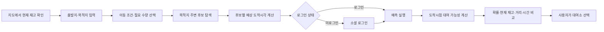
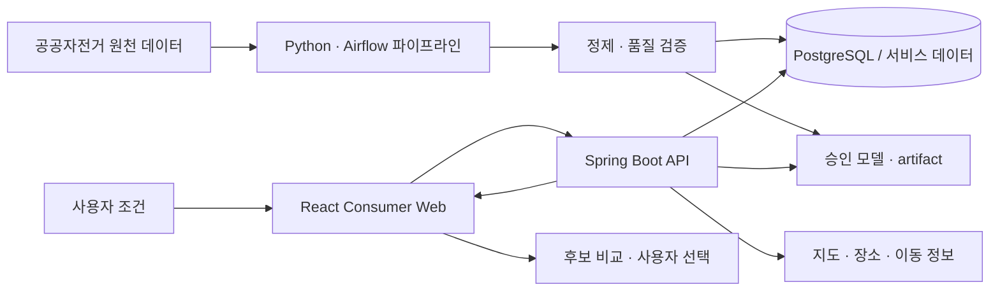

# 따라가요 — 따릉이 도착시점 대여 가능성 추천 서비스

> **“지금 자전거가 몇 대 있나?”가 아니라, “내가 도착했을 때 필요한 자전거가 남아 있을 가능성은 얼마나 되나?”를 답하는 데이터 기반 의사결정 지원 서비스입니다.**

`따라가요`는 사용자의 출발지·목적지와 이동 조건을 바탕으로 목적지 주변 따릉이 대여소 후보의 예상 도착시각을 계산하고, 그 시점의 대여 가능성을 현재 재고·거리·이동시간과 함께 비교해 더 나은 대여소 선택을 돕는 5인 팀 프로젝트입니다.

- **기간:** 5주
- **구성:** Consumer Web · Data/ML · Operations
- **핵심 기술:** React · Spring Boot · Python · PostgreSQL · Airflow · OCI · GitHub Actions
- **Portfolio Final 기준:** `2026-09-12` · `main@12ee414f48f1141e39aff8fb3198b683e5a42b9a`
- **상세 프로젝트 문서:** [Public Notion](https://app.notion.com/p/3cd00ce3705c81d09070db8b3dfc04bf)
- **기준 코드:** [Portfolio baseline commit](https://github.com/dataAnalyzeProject/ddarung-flow/tree/12ee414f48f1141e39aff8fb3198b683e5a42b9a)

> 발표 종료 후 채용 제출용 포트폴리오 기준으로 동결한 문서입니다. 실행 중인 서버 주소보다 **코드·검증 근거·Public Notion**을 장기 기준으로 사용합니다.

---

## 1. 프로젝트 한눈에 보기

| 항목 | 내용 |
|---|---|
| 문제 | 현재 재고만으로는 사용자가 실제 대여소에 도착했을 때의 재고를 알 수 없음 |
| 해결 | 후보별 예상 도착시각을 계산하고 해당 시점의 대여 가능성을 예측 |
| 사용자 판단 | 예측 확률 · 현재 재고 · 거리 · 이동시간을 함께 비교해 대여소 선택 |
| 예측 범위 | H1~H4 — 60 / 120 / 180 / 240분 |
| 필요 수량 | 1~5대 기준 대여 가능성 |
| 데이터 품질 | 2025년 4분기 과거 재고 6,152,132행 검사 |
| 결합 품질 | 월별 최저 대여소 ID 결합률 99.6427% |
| 최종 검증 | Portfolio baseline SHA에서 CI · Staging CD · Runtime Evidence 성공 |

### 핵심 질문

서울시 따릉이처럼 재고가 계속 변하는 서비스에서는 **현재 재고가 많다는 사실만으로 도착 시점의 대여 가능성을 보장할 수 없습니다.**

따라가요는 이 문제를 다음 순서로 풀었습니다.

1. 사용자가 출발지와 목적지를 입력합니다.
2. 목적지 주변에서 실제로 선택 가능한 대여소 후보를 찾습니다.
3. 후보별 이동시간과 예상 도착시각을 계산합니다.
4. 도착시각에 대응하는 H1~H4 예측 구간을 결정합니다.
5. 최신 정상 재고와 요청시각 피처를 기준으로 승인 모델을 추론합니다.
6. 확률·현재 재고·거리·이동시간을 함께 보여 주고 최종 선택은 사용자에게 맡깁니다.

---

## 2. 핵심 사용자 흐름



현재 재고 탐색은 빠르게 확인할 수 있도록 공개 흐름으로 두고, 미래 대여 가능성 예측과 사용자 상태를 다루는 보호 기능은 로그인 이후로 분리했습니다.

---

## 3. 데이터에서 사용자 선택까지

따라가요의 중심은 “모델을 만들었다”가 아니라 **데이터·모델 결과를 실제 사용자 선택으로 연결했다는 점**입니다.



### 데이터·모델에서 지킨 원칙

- 원천 데이터를 바로 학습에 사용하지 않고 **정합성·결측·결합 품질을 먼저 확인**했습니다.
- 현재 재고와 미래 예측은 같은 숫자처럼 섞지 않고 **각각의 기준시각을 구분**했습니다.
- 데이터 누락·지연을 임의로 `0대`나 정상 상태로 바꾸지 않습니다.
- 도착시각이 너무 가까워 대응 가능한 미래 예측 구간이 없으면 확률을 억지로 만들지 않고 **최신 현재 재고와 안내**를 제공합니다.
- 서비스가 지원하지 않는 범위와 모델이 약한 구간을 숨기지 않는 방향으로 설계했습니다.

모델 평가 조건과 데이터 검증 근거는 [Public Notion](https://app.notion.com/p/3cd00ce3705c81d09070db8b3dfc04bf)에 함께 정리했습니다.

---

## 4. 주요 기능

### Consumer Core

- Kakao 지도 기반 대여소·장소 탐색
- 현재 따릉이 재고 확인
- 출발지·목적지·이동 조건 입력
- 목적지 주변 후보 대여소 탐색
- 후보별 예상 도착시각 계산
- 도착시점 대여 가능성 예측
- 필요 수량 1~5대 기준 비교
- 확률·현재 재고·거리·시간 비교
- 대여소 상세 정보 확인

### Consumer Support

- Google · Kakao · Naver OAuth2 로그인
- 저장 대여소·저장 경로·예측 이력 등 사용자 보조 흐름
- Q&A·알림·신뢰도 정보
- Journey 자연어 입력을 핵심 검색 조건으로 연결하는 선택적 보조 UX

### Operations / Data·ML

- 데이터 수집·정제·품질 상태 확인
- 운영·모델·시스템 상태를 위한 관리자 콘솔
- 모델 artifact와 추론 흐름 관리
- CI/CD 및 staging runtime 검증 근거 관리

---

## 5. 기술 스택

| 영역 | 기술 |
|---|---|
| Frontend | React 18 · JavaScript · React Testing Library |
| Backend | Java 21 · Spring Boot 3.5 · Spring Security · OAuth2 · Spring Data JPA · Flyway |
| Data / ML | Python · Airflow · 모델 학습/평가 파이프라인 · Parquet |
| Database | PostgreSQL |
| External | 서울시 공공자전거 데이터 · Kakao Maps/Local/이동 정보 · Google/Kakao/Naver OAuth2 |
| Infra | OCI · Object Storage · Linux 기반 staging 환경 |
| CI/CD | GitHub Actions · CI · Staging CD · Runtime Evidence |
| Documentation / Collaboration | GitHub PR · Notion WBS/작업 계약 · 인수 근거 관리 |

---

## 6. 시스템 설계에서 중요하게 본 것

### 현재 재고와 미래 예측의 책임 분리

지도·장소·이동 정보는 경로와 후보를 결정하기 위한 정보이며, 따릉이 재고와 미래 대여 확률의 출처가 아닙니다. 서비스 데이터와 외부 지도 정보를 구분하고 화면에서도 기준시각을 분리했습니다.

### 인증 경계

현재 상태 탐색은 로그인 없이 사용할 수 있지만, 예측 실행과 사용자 상태 저장처럼 보호가 필요한 기능은 인증 이후로 분리했습니다. 로그인 과정 때문에 사용자가 입력한 검색 조건이 사라지지 않도록 사용자 흐름도 별도로 다뤘습니다.

### 실패를 정상 값으로 위장하지 않기

데이터가 없거나 지연된 경우, 지원하지 않는 예측 구간인 경우, API 연결이 불가능한 경우를 각각 구분합니다. 특히 `missing`이나 `unavailable`을 `0`과 동일하게 취급하지 않는 것을 데이터·UI 공통 원칙으로 뒀습니다.

---

## 7. 화면 예시

아래 이미지는 대여소 상세 화면의 실제 포트폴리오 자산입니다.


Consumer 검색 → 예측 → 후보 비교 → 선택 가이드와 Data/ML·Operations의 상세 화면 및 검증 이미지는 [Public Notion](https://app.notion.com/p/3cd00ce3705c81d09070db8b3dfc04bf)에서 확인할 수 있습니다.

---

## 8. PM / 관리 — 김선호의 기여

이 프로젝트는 5인 팀 프로젝트이며, 아래는 최종 발표 기준원장에 확정된 개인 역할을 기준으로 정리했습니다.

**Role: PM / 관리**

- **WBS · 작업 기준 관리:** 프로젝트 범위, 작업 계약, 우선순위와 인수 기준을 문서화하고 실제 작업 상태와 연결
- **통합 관리:** 기능별 PR과 기준선을 추적하고 팀 작업을 최종 서비스 흐름으로 통합하는 과정 관리
- **CI/CD · 배포 근거:** CI, Staging CD, Runtime Evidence를 기준으로 변경사항이 실제 배포 상태와 일치하는지 검증
- **발표·인수 근거:** 기능 완료를 주장하기 전에 코드·실화면·테스트·배포 증거를 맞추고 최종 발표 및 공개 문서의 근거를 정리

팀 전체가 구현한 기능을 개인 성과로 합산하지 않고, 개인 기여와 프로젝트 전체 결과를 구분해 기술했습니다.

---

## 9. 최종 검증 기준

포트폴리오 기준 코드는 다음 commit으로 고정합니다.

```text
12ee414f48f1141e39aff8fb3198b683e5a42b9a
```

해당 `main` 기준으로 확인한 배포·검증 파이프라인:

| 검증 | 결과 |
|---|---|
| CI | SUCCESS |
| Staging CD | SUCCESS |
| Staging Runtime Evidence | SUCCESS |

실행 중인 서버는 포트폴리오 이후 다른 프로젝트를 위해 이전·중단될 수 있으므로, **이 commit과 Public Notion을 장기 재현 기준**으로 사용합니다.

---

## 10. 의도적으로 제외한 범위

5주 프로젝트에서 검증 가능한 핵심 가치에 집중하기 위해 아래 기능은 현재 완료 기능으로 주장하지 않습니다.

- 따릉이 예약 또는 대여 보장
- 실제 이용권 판매·실과금·정산
- 미래 반납 가능성 예측을 현재 Core 완료 기능으로 주장하는 것
- Valhalla 기반 자전거 내비게이션을 현재 Core 기능으로 주장하는 것
- 고도·자전거도로 비율을 현재 Journey의 검증된 수치로 제공하는 것
- Digital Twin·실시간 음성을 현재 릴리스의 필수 기능으로 주장하는 것

---

## 11. 로컬 실행

### Frontend

```bash
cd frontend
npm install
npm start
```

### Backend

macOS / Linux:

```bash
cd backend
./gradlew test
./gradlew bootRun
```

Windows:

```powershell
cd backend
.\gradlew.bat test
.\gradlew.bat bootRun
```

실제 서비스 기능을 모두 연결하려면 DB와 외부 API/OAuth 등 환경변수가 필요합니다. **비밀키·비밀번호·운영 credential은 저장소에 포함하지 않습니다.**

---

## 12. 더 자세히 보기

- **프로젝트 전체 설명 · 화면 · 데이터/ML · Operations:** [따라가요 Public Notion](https://app.notion.com/p/3cd00ce3705c81d09070db8b3dfc04bf)
- **최종 포트폴리오 코드 기준:** [`main@12ee414`](https://github.com/dataAnalyzeProject/ddarung-flow/tree/12ee414f48f1141e39aff8fb3198b683e5a42b9a)
- **GitHub Repository:** [dataAnalyzeProject/ddarung-flow](https://github.com/dataAnalyzeProject/ddarung-flow)

---

### Portfolio Final

이 저장소는 발표 종료 후 **채용 제출용 최종 포트폴리오 기준**으로 정리되었습니다. 이후 실험이나 신규 프로젝트 작업은 이 기준선과 분리해 관리합니다.
