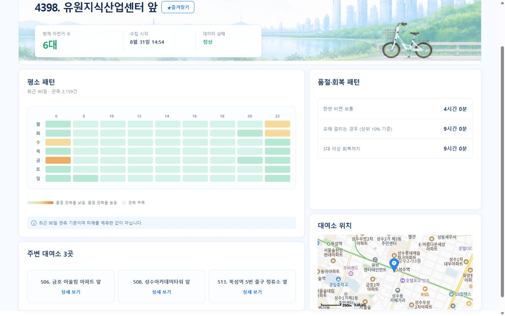

# DDARUNG FLOW

> **도착했을 때 필요한 수량을 빌릴 가능성을 보고, 더 나은 따릉이 대여소 선택을 돕는 PC 웹 MVP**

5주 동안 5명이 만든 DDARUNG FLOW는 현재 재고만 보는 탐색을 넘어, 사용자가 실제로 도착할 시점의 대여 가능성을 후보별로 비교하도록 설계했다. 6,152,132행의 과거 재고 데이터를 점검했고, 월별 최저 대여소 ID 결합률은 99.6427%였으며, H1~H4 시간 범위와 필요 수량 1~5대를 제품 판단 범위로 사용한다.

## 1. Project Overview

따릉이를 빌리려는 시민이 출발지·목적지·이동 조건을 입력하면, 목적지 주변 후보 대여소의 도착시점 대여 가능성을 비교하고 선택을 지원하는 서비스다.

## 2. Problem

지금 자전거가 있는 대여소라도 사용자가 도착했을 때는 필요한 수량이 남아 있지 않을 수 있다. 가까운 대여소 하나만 보여 주는 방식으로는 이 시간 차이를 설명하기 어렵다.

DDARUNG FLOW는 ‘현재 재고가 있나?’와 ‘도착했을 때 필요한 수량을 빌릴 가능성이 있나?’를 분리해 판단하도록 문제를 정의했다.

## 3. Solution

장소와 이동 조건에서 도착시각을 계산한 뒤, 후보별 필요한 수량 이상 확보 확률·현재 재고·거리·예상 도착시간을 함께 보여 준다. 사용자가 단일 정답을 받는 대신 판단 근거를 비교할 수 있게 하는 흐름이다.

## 4. Consumer Core — 실제 서비스

### 4.1 사용 조건과 도착시각 계산

출발지와 목적지, 이동 수단, 필요한 자전거 수를 입력하면 실제 경로와 예상 도착시간을 계산한다. 이 단계는 현재 재고를 탐색하는 일과 미래 판단을 위한 조건을 만드는 일을 분리한다.

### 4.2 도착시점 대여 가능성 예측

로그인 후에는 목적지 주변 후보를 대상으로 도착시점의 **필요 수량 이상 확보 확률**을 확인할 수 있다. 이 값은 확정된 이용 가능 여부가 아니라, 선택을 돕는 예측 정보다.

### 4.3 후보 비교

가장 가까운 대여소가 항상 가장 나은 선택은 아니다. 후보 비교에서는 확률뿐 아니라 현재 재고, 거리, 예상 도착시간을 함께 읽어 각 대안의 차이를 판단한다.

### 4.4 후보 선택 가이드

예측값 하나가 이용 결정을 대신하지 않도록, 후보 가이드는 대여 가능성·1~5대 수량별 가능성·도착지 날씨·대기질·주의사항을 분리해 제공한다. 사용자는 대여소별 결과와 이동 환경 정보를 함께 보고 자신의 우선순위에 맞게 선택한다.

### 4.5 대여소 상세

선택한 대여소에서는 현재 재고와 최근 90일 관측 패턴, 품절 지속·회복 특성, 실제 위치와 주변 대여소를 확인합니다. 과거 관측 패턴은 도착시점 미래 예측과 구분해 제공합니다.

## 5. 보조 입력 UX — 자연어 Journey

Journey는 별도의 추천 서비스가 아니라 Consumer Core로 들어가기 위한 선택적 보조 입력이다. 사용자가 자연어로 의도를 표현하면 출발지·목적지·출발 희망 시각·필요 자전거 수를 기존 Consumer Core 검색 조건으로 구조화한다.

장소·경로·현재 재고·대여 가능성 예측·거리·시간은 Consumer Core와 검증된 도구의 결과를 사용한다. AI는 이 수치나 실제 장소를 새로 생성하는 source of truth가 아니다.

## 6. Data & ML Evidence

### 데이터 품질부터 확인

0대는 실제 관측값일 수 있다. 반면 `MISSING`은 관측값이 없거나 사용할 수 없는 상태다. 두 상태를 같은 값으로 처리하지 않는 것이 이후 확률 해석의 전제다.

### 필요한 수량을 확률로 해석

재고를 0, 1, 2, 3, 4, 5+의 6개 구간으로 표현한 뒤, 사용자가 선택한 필요 수량 이상이 남아 있을 확률로 결과를 해석한다. 이 방식은 ‘자전거가 있나?’보다 ‘내가 필요한 수량을 확보할 수 있나?’에 맞춘 질문이다.

### 평가는 한계와 함께 읽기

현행 평가는 재구성한 과거 데이터에서 확인한 결과이며, 과거 이진 기준선과 같은 성능으로 직접 비교하지 않는다. 결과를 선택 지원 정보로 쓰되, 보장으로 해석하지 않는 이유다.

### 제품에 연결되는 책임

Consumer는 요청 시점에 비공개 추론으로 도착시점 확률을 계산한다. Operations는 소스 기반 위험 스냅샷으로 대여 부족 위험을 우선 확인한다. 두 역할을 같은 서빙 경로나 같은 모델 아티팩트라고 가정하지 않는다.

## 7. Operations Console

운영 콘솔은 소비자 후보를 대신 결정하는 도구가 아니라, 운영자가 대여 부족 위험을 확인하고 우선 살펴볼 대상을 찾는 보조 화면이다. 데이터가 부족하거나 누락된 경우에도 이를 정상·0·안전으로 바꾸지 않고 상태로 표시한다.

## 8. Architecture

PC 웹, API, 지도·경로 연동, 데이터 저장소, 비공개 추론을 역할별로 분리했다. 지도와 경로는 Kakao 연동을 사용하고, 웹에서 만든 사용 조건은 API를 거쳐 Consumer 추론으로 전달된다.

## 9. Batch vs Online

Airflow 기반 배치는 재고 수집·품질 점검·아티팩트 증빙을 담당한다. 반면 Consumer의 도착시점 확률은 사용자의 요청 시점에 별도 비공개 추론으로 계산한다. 배치가 Consumer 확률을 직접 제공하는 구조가 아니다.

## 10. Auth / Authz / Delivery

탐색은 비로그인으로 시작할 수 있지만, 미래 대여 가능성 예측은 소셜 로그인 후 실행한다. Google·Kakao·Naver OAuth2 로그인과 서버 측 권한 검사를 사용하며, 관리자 API는 ADMIN 권한이 없으면 서버에서 거부한다.

GitHub Actions는 변경 경로에 따라 검증을 수행하고, 같은 SHA 확인·헬스 점검·스모크·롤백 절차를 전달 경로에 둔다.

## 11. Testing & Reliability

테스트와 CI 통과는 필요한 증거지만, 그 자체가 운영 릴리스 승인을 뜻하지는 않는다. 실제 화면·데이터 상태·인증·배포 경계는 각기 별도로 확인해야 한다.

> **CI PASS ≠ RELEASE PASS**

## 12. Troubleshooting

### Staging acceptance

배포 대상과 현재 코드가 같은 SHA인지, 실제 서비스 경로가 정상인지, 화면까지 확인했는지를 분리해서 점검한다. HTTP 응답 하나만으로 사용자 흐름의 성공을 단정하지 않는다.

### Missing vs zero

0대는 유효한 관측값일 수 있지만 `MISSING`·`UNAVAILABLE`은 데이터가 없거나 사용할 수 없는 상태다. 운영과 사용자 화면 모두 이 차이를 숨기지 않는다.

### RBAC / 403

관리자 권한은 화면 표시 여부가 아니라 서버 측 API 권한으로 제한한다. 권한이 없는 요청은 403으로 거부되어야 한다.

## 13. Collaboration

5주, 5명의 팀이 제품·프론트엔드·백엔드·데이터·운영 관점을 연결해 만들었다. AI 도구는 구현과 검증을 보조했지만, 기능 범위·데이터 의미·공개 표현·승인 경계는 사람이 확인하고 결정했다.

## 14. Tradeoffs & Limitations

- 결과는 도착시점 대여 가능성으로, 확정된 이용 가능 여부가 아니다.
- 현재 재고와 미래 예측, 그리고 누락 상태를 서로 다른 정보로 다룬다.
- 현행 평가는 재구성한 과거 데이터 기준이며, 독립 봉인 평가 또는 기준선 대비 개선을 주장하지 않는다.
- 운영 콘솔은 위험 확인을 지원하며 자동 재배치·미래 반납 최적화를 제공하지 않는다.
- Consumer 요청 시점 추론과 Operations 위험 스냅샷의 책임을 분리한다.

## 15. What We Proved

- 현재 재고만으로는 부족한 ‘도착시점’의 질문을 제품 흐름으로 만들었다.
- 사용자가 필요한 수량, 거리, 도착시간, 확률을 함께 비교할 수 있게 했다.
- 데이터의 0과 누락을 구분해 잘못된 확신을 줄였다.
- Consumer 의사결정과 Operations 위험 확인의 역할을 분리했다.
- 인증·권한·검증·전달을 제품 기능과 함께 고려했다.

## 16. Retrospective

예측 기능의 가치는 단일 정확도 숫자보다, 사용자가 무엇을 판단하는지와 데이터 상태를 얼마나 정직하게 보여 주는지에서 커진다. 다음 단계에서도 확률의 한계, 데이터 신선도, 운영 확인 절차를 명확히 한 채 사용자 경험을 확장한다.

## 17. Links

- [Actual Service](https://shdomain.kro.kr)
- [GitHub Repository](https://github.com/dataAnalyzeProject/ddarung-flow)
- Presentation link: **PLACEHOLDER — 공개 후 추가**
- Demo link: **PLACEHOLDER — 별도 공개 시 추가**

---

### Publication note

이 원고는 기존 실제 화면·기존 데이터/아키텍처 증빙만 조립한 공개용 초안이다. 실제 Notion 반영 전에는 현재 원격 `main`과 공개 Notion의 상태·배포 표현을 다시 대조해야 한다.
